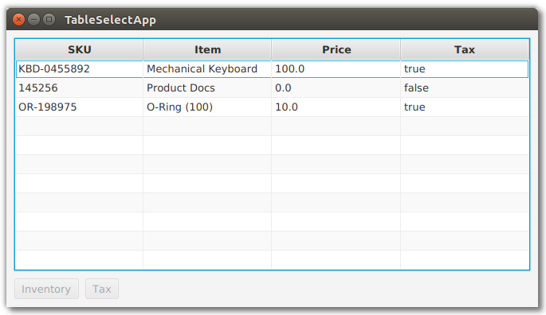

# TableView

For JavaFX business applications, the TableView is an essential control. Use a TableView when you need to present multiple records in a flat row/column structure. This example shows the basic elements of a TableView and demonstrates the power of the component when JavaFX Binding is applied.

The demonstration app is a TableView and a pair of Buttons. The TableView has four TableColumns: SKU, Item, Price, Tax. The TableView shows three objects in three rows: Mechanical Keyboard, Product Docs, O-Rings. The following screenshot shows the app immediately after startup.

The disabled logic of the Buttons is based on the selections in the TableView. Initially, no items are selected so both Buttons are disabled. If any item is selected — the first item in the following screenshot — the Inventory Button is enabled. The Tax Button is also enabled although that requires consulting the Tax value.

If the Tax value for the selected item is false, then the Tax Button will be disabled. This screenshot shows the second item selected. The Inventory Button is enabled but the Tax Button is not.

